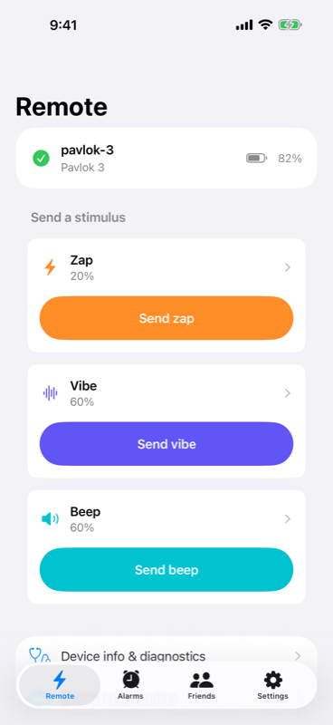
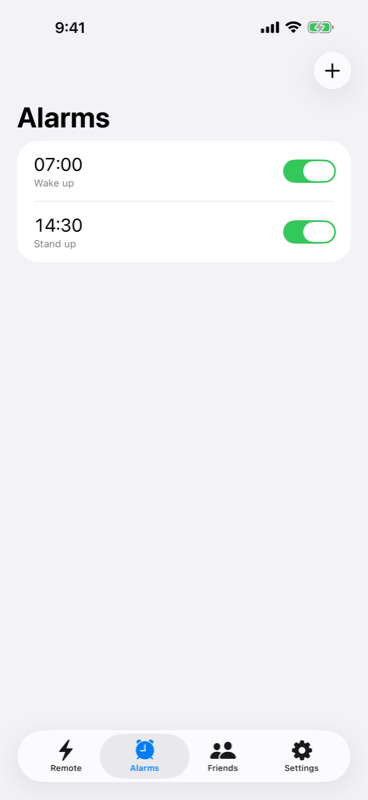
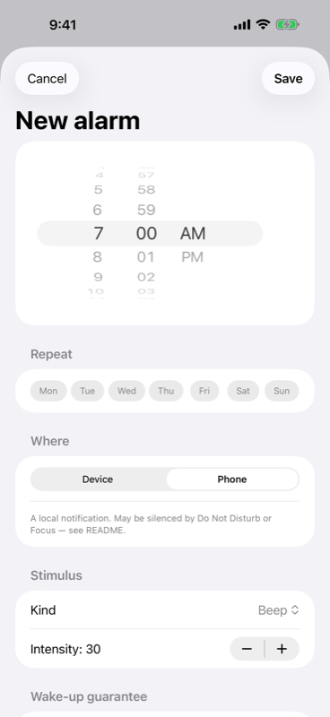

# Jolt Remote

[](https://github.com/petrleocompel/jolt-ios/actions/workflows/ci.yml)
[](LICENSE)

An independent iOS client for Pavlok wearables: fire stimuli, set alarms that
live on the device, and let friends poke you from anywhere.

<p>
  
  
  
</p>

Website: <https://petrleocompel.github.io/jolt-ios/> · App Store: coming soon

Not affiliated with or endorsed by Pavlok Inc. Works with Pavlok 2 and
Pavlok 3; Shock Clock Max connects but cannot fire a stimulus yet (see
[Known gaps](#known-gaps)).

## Features

- **Zap, vibe and beep** at any intensity and repeat count the device supports.
- **Device alarms** stored on the wearable and fired by its own clock, so they
  ring even when the phone is off or silenced; phone alarms as a fallback.
- **Wake-up guarantee**: solve a math puzzle, do jumping jacks or scan a QR code
  before an alarm stops.
- **Button configuration** and live battery, firmware and connection state.
- **Friends and pokes** through a self-hostable [Jolt Server]: per-friend,
  per-stimulus permissions with intensity caps and cooldowns, Do Not Disturb,
  and opt-in automated pokes from a friend's scripts.
- **Pavlok account** (optional): sign in to poke your existing Pavlok friends.
- Controlling your own device needs no account and no network.

## Build from source

Requirements: macOS with Xcode 26 or later (iOS 17.0+ deployment target),
[XcodeGen] and [SwiftLint].

```bash
brew install xcodegen swiftlint
git clone https://github.com/petrleocompel/jolt-ios.git
cd jolt-ios
xcodegen --spec project.yml
open Jolt.xcodeproj
```

`project.yml` is the source of truth; `Jolt.xcodeproj` is regenerated from it,
so edit the YAML and rerun `xcodegen` rather than changing project settings in
Xcode.

To run on a real phone (Bluetooth needs one; the simulator can't reach a
wearable), pick your own team and a unique bundle identifier under
**Signing & Capabilities**. Push notifications (pokes) need a paid Apple
Developer account; everything else works with a free one.

Without a wearable, the `-fakeDevice` launch argument stands in for one, and
`-snapshotMode` swaps the server for the in-memory `MockSocialBackend`.

## Server

Friends, permissions and pokes go through a [Jolt Server], which you can host
yourself (its `docs/SELFHOSTING.md` covers running one with Docker Compose).

The server a fresh install points at comes from the `JOLT_DEFAULT_SERVER_URL`
build setting, which defaults to the placeholder
`https://jolt.example.com/api/v1`:

```bash
xcodebuild -scheme Jolt JOLT_DEFAULT_SERVER_URL=https://jolt.your-domain.example/api/v1 …
```

In the app it's a setting either way: **Settings → Server**. Accounts are
per-instance: switching servers signs you out, and friends and poke history
stay behind on the old one. The bearer token is kept in the keychain, scoped to
the server that issued it.

**Settings → Notifications** sends a test push through that server to this
phone — the same alert + silent pair a poke uses, but carrying no poke, so it
works with no friends, no permissions and (unless you ask it to fire) no
wearable connected. The phone acks it back, so "Arrived in 1.2s" means it
genuinely got there rather than that Apple accepted it.

Pushes reach the phone whichever way the server says (`GET /push/config`):
straight from the server when it holds its own APNs credentials, or through a
Jolt push relay when it doesn't, which lets a self-hosted server push to the
official app without an Apple developer account. Through a relay, the app
registers its APNs token with the relay, generates a key per server and gives
the server only the relay's token and that key; pokes travel encrypted, and a
Notification Service Extension decrypts them before they are shown. The app
only registers with relays on its built-in list, the space-separated
`JOLT_TRUSTED_RELAY_HOSTS` build setting, which is empty in `project.yml`: a
build from source trusts no relay until you set it. **Settings →
Notifications** shows which way this phone is registered and, for a relay,
the server's ID.

Friends can also poke you from scripts, with API tokens minted on the server's
web dashboard (the app has no token UI). Whether a friend's scripts may send
you a given stimulus is a separate answer under **Friends → friend →
Permissions → Automated pokes**: Default, Allow or Block, where Default follows
the server's policy and says what that currently is. Presets and slider edits
never change it. Pokes a script sent are marked with a gearshape in the
activity log and on the dashboard. Against a server too old to know about any
of this, the setting is simply not shown.

## Development

```bash
swiftlint --strict
xcodebuild test -project Jolt.xcodeproj -scheme Jolt \
  -destination 'platform=iOS Simulator,name=iPhone 17'
```

UI and screenshot tests run against `MockSocialBackend`, so they need no
server. `QuickPokeComposerUITests` is the exception: it runs against a real
server when given `JOLT_TEST_SERVER_URL`, `JOLT_TEST_EMAIL` and
`JOLT_TEST_PASSWORD` (prefixed `TEST_RUNNER_` on the `xcodebuild` command
line) and skips otherwise.

Fastlane wraps the same steps (`bundle install` first):

```bash
bundle exec fastlane dev              # lint + test + debug build
bundle exec fastlane screenshots      # App Store screenshots, flattened (needs ImageMagick)
bundle exec fastlane design_compare   # app screens (light + dark) vs the docs/design replica
```

The release lanes (`beta`, `internal`, `store_assets`) need App Store Connect
API credentials (`APP_STORE_CONNECT_KEY_ID`, `APP_STORE_CONNECT_ISSUER_ID`, and
`APP_STORE_CONNECT_KEY_PATH` or base64 `APP_STORE_CONNECT_KEY`) and are run by
the maintainer.

### Project layout

```
App/           # @main, root UI, AppEnvironment
Features/      # feature modules (alarms, device control, friends, settings)
Domain/        # models and repository protocols
Data/          # repositories: device (BLE, fake), HTTP and mock server backends, stores
Shared/        # push decryption, compiled into both the app and the extension
NotificationService/  # Notification Service Extension: rewrites relayed alerts
BLE/           # Bluetooth: legacy Pavlok 2/3 GATT, Shock Clock Max codec
Resources/     # Info.plist, assets, entitlements
JoltTests/     # unit tests
UITests/       # UI, screenshot and design-reference tests
docs/          # protocol notes, brand guide, design replica
site/          # website (Astro Starlight → GitHub Pages)
fastlane/      # lanes, Snapfile, App Store metadata
project.yml    # XcodeGen source of truth
```

Protocol notes for the Pavlok devices and API are in
[`docs/RE-FINDINGS.md`](docs/RE-FINDINGS.md) and
[`docs/PAVLOK-API.md`](docs/PAVLOK-API.md); brand assets in
[`docs/BRAND.md`](docs/BRAND.md).

## Known gaps

- **Shock Clock Max wire protocol is unimplemented.** `BLE/SCMax/ESF` has a
  working LEB128/TLV codec (message *shape* recovered from the Android app),
  but the opcode numbers and field layouts could not be recovered by string
  analysis. `BLE/SCMax/ProtocolMap.swift` documents the values still needed and
  how to capture them (Android HCI snoop log while using the official app
  against a real device). Until then, Shock Clock Max connects and reads
  standard GATT (battery, device info) but cannot fire a stimulus.
- **Pavlok 2/3 legacy GATT** uses proprietary characteristics under the
  Bluetooth base UUID (`0x1001`–`0x7001` family), cross-checked against a real
  Pavlok 3.
- **Phone-side alarms cannot force a silenced iOS device to sound**, unlike
  Android. They're built on `UNNotificationRequest` (`Features/Alarms`).
  Reliable wake-the-phone behaviour would need Apple's Critical Alerts
  entitlement. Device alarms (stored on the wearable, fired by its own RTC) do
  not have this limitation and are the primary path.

## Contributing

Issues and pull requests are welcome on GitHub; see
[CONTRIBUTING.md](CONTRIBUTING.md) and the [Code of Conduct](CODE_OF_CONDUCT.md).
Signed builds, TestFlight and App Store releases run on the maintainer's
private CI; contributions go through GitHub pull requests. Report security
issues privately as described in [SECURITY.md](SECURITY.md).

## License

[Mozilla Public License 2.0](LICENSE). The license covers the code, not the
Jolt name or logo. Pavlok is a trademark of Pavlok Inc.

[Jolt Server]: https://github.com/petrleocompel/jolt-server
[XcodeGen]: https://github.com/yonaskolb/XcodeGen
[SwiftLint]: https://github.com/realm/SwiftLint
